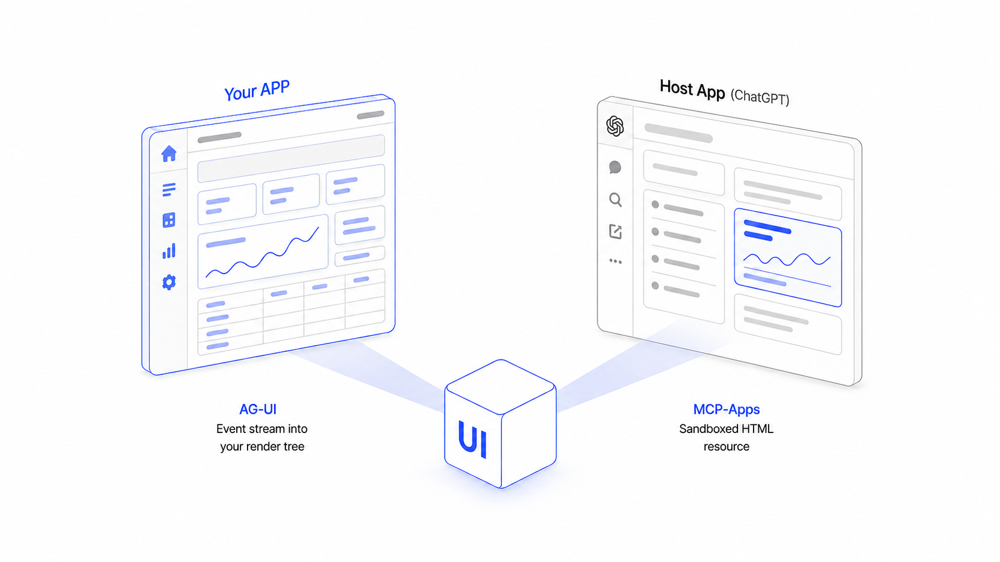
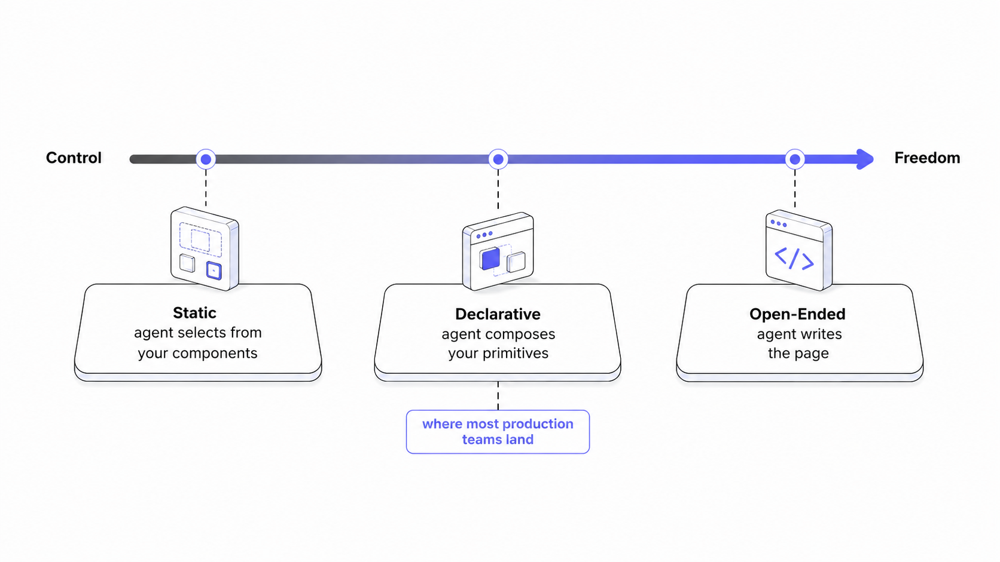
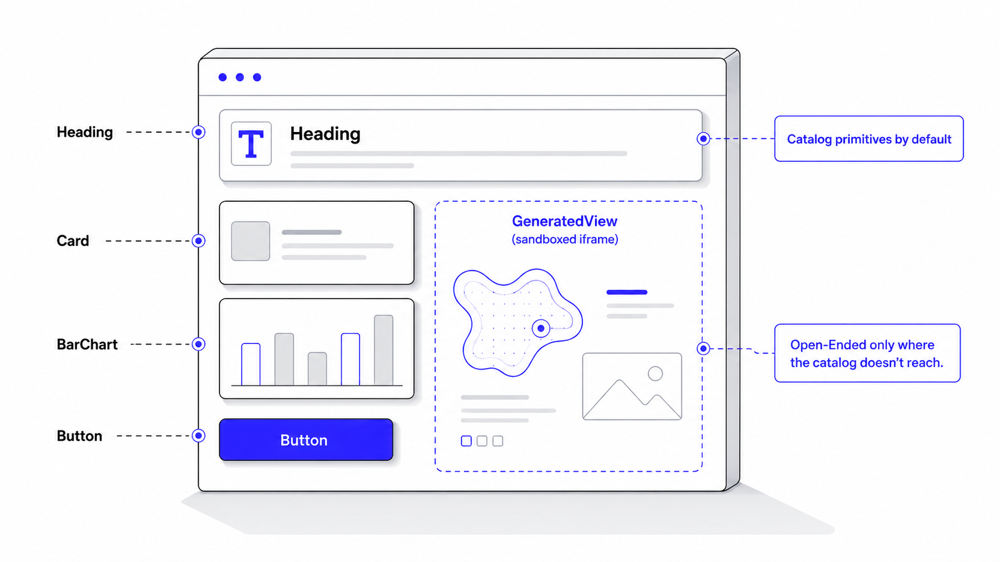
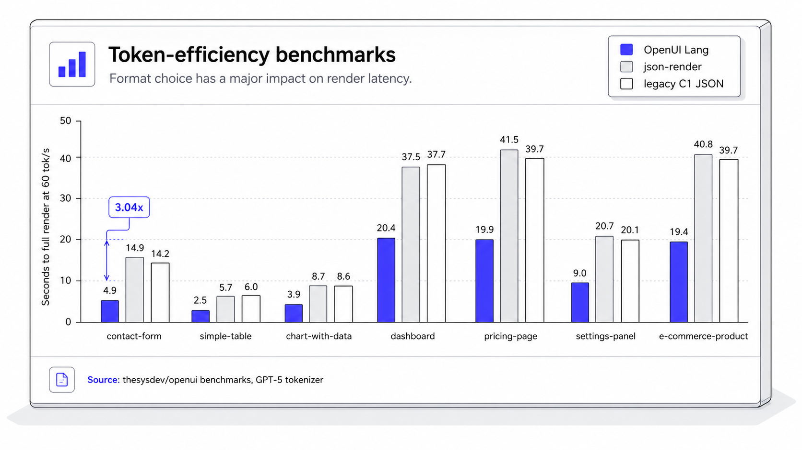

Generative UI (interfaces generated by an agent at runtime rather than built ahead of time) has settled into a recognizable stack in 2026. This report surveys that stack: the protocols (AG-UI, MCP-Apps), the generation formats (OpenUI, A2UI, json-render, raw HTML), and the measurements that should inform a choice between them.

Discussions of Generative UI tend to conflate two decisions that are independent:

1. **Transport**: where does the UI need to appear, and who owns that surface?
2. **Generation**: what does the agent emit to fill it?

Most disagreements about which library to use dissolve once these are separated. They are two independent axes (two transports, three generation styles), and any pairing is valid.


This post covers both axes in turn: the protocols, the formats, and the tradeoffs as they exist as of June 2026. It closes with a decision procedure. For the generation axis it uses a three-way split: Static, Declarative, and Open-Ended.

## Transport: AG-UI vs MCP-Apps

The transport decision is independent of how the UI is generated. It is determined entirely by where the UI needs to appear: in a frontend you own, or in a host you don't.

### AG-UI: streaming agent UI into your own frontend

[AG-UI](https://docs.ag-ui.com/) is an event protocol for streaming agent output into an application you control. It defines roughly sixteen standardized event types (`TEXT_MESSAGE_CONTENT`, `TOOL_CALL_START`, `STATE_DELTA`, and so on), is transport-agnostic over SSE/WebSocket/webhook, and is bidirectional: the client can send tool calls and user input back upstream.

It occupies the third slot in the current agent-protocol stack: [MCP](https://modelcontextprotocol.io/) connects agents to tools and data, [A2A](https://a2a-protocol.org/) connects agents to each other, and AG-UI connects agents to the user-facing application. The three are complementary rather than competing.

Adoption as of June 2026: LangGraph, CrewAI, Mastra, AG2, Agno, LlamaIndex, Pydantic AI, Google ADK, AWS Strands, Microsoft Agent Framework, the Claude Agent SDK, and Langroid all ship supported AG-UI integrations. The OpenAI Agent SDK, AWS Bedrock Agents, and Cloudflare Agents integrations are in progress. The protocol is MIT-licensed, at [`ag-ui-protocol/ag-ui`](https://github.com/ag-ui-protocol/ag-ui).

If the agent is a feature inside your own product, where you control the page, the render tree, and the design system, AG-UI is the transport.

### MCP-Apps: rendering UI inside ChatGPT, Claude, and other hosts

The second case: the UI needs to appear inside a host you don't control, such as ChatGPT, Claude Desktop, or VS Code Copilot. You cannot stream events into a render tree you don't own.

MCP-Apps ([SEP-1865](https://modelcontextprotocol.org/seps/1865-mcp-apps-interactive-user-interfaces-for-mcp), upstreamed into MCP from the community [MCP-UI](https://mcpui.dev/) project and stable as the protocol's first official extension since January 2026) addresses this. An MCP server registers a tool whose result references a `ui://` resource, a self-contained HTML+JS+CSS document. The host fetches the resource and renders it in a sandboxed iframe alongside its own UI.

```ts
// Tool result references a ui:// resource
{
  name: "show_revenue_chart",
  _meta: { ui: { resourceUri: "ui://acme/revenue-chart" } }
}

// Server serves the resource
{
  uri: "ui://acme/revenue-chart",
  mimeType: "text/html",
  text: "<!doctype html><html>...inline CSS+JS...</html>"
}
```

The security model is mandatory: iframe sandbox with no outside DOM/cookie/storage access, `postMessage` as the only communication channel, CSP declared by the server and enforced by the host. Servers declare permissions (`camera`, `geolocation`, `clipboardWrite`); hosts may refuse them. The SDK is `@mcp-ui/server` (MIT). Hosts as of June 2026: Claude (web and desktop), ChatGPT Apps, VS Code Copilot, Goose, and Postman.

The tradeoffs follow from the design. Sandboxing adds overhead. The resource does not share a design system with the host, so achieving a native look in each host takes additional work. And there is no incremental streaming over the transport: the resource arrives whole, and anything dynamic inside it performs its own fetches.

### AG-UI vs MCP-Apps is a false choice

"AG-UI vs MCP-Apps" implies a choice that, for many teams, doesn't exist. A team building an agent feature into its own product that also wants a presence inside ChatGPT or Claude ships the same agent over both transports: AG-UI for its own application, MCP-Apps for distribution into hosts it doesn't own. The question is not which protocol wins but where the UI needs to appear, and the answer is frequently "both places."



## Generation: Static vs Declarative vs Open-Ended

The generation decision is a tradeoff between control (how much the host enforces) and freedom (how much the model gets to invent). The three styles are points on that axis.



### Static generation: the agent selects pre-built components

Components are built ahead of time and registered with schemas; the agent selects which component to render and supplies props. The model's contribution is selection, not design: effectively a typed function call whose return value is a UI. (The AG-UI ecosystem calls this tool-based generative UI, which is arguably the more accurate name, since nothing is generated.)

```ts
// Register components with schemas; the agent picks one and fills in props
registerComponent({
  name: "RevenueChart",
  schema: z.object({ months: z.array(z.string()), values: z.array(z.number()) }),
  component: RevenueChart,
});
// Agent emits: { component: "RevenueChart", props: { months: [...], values: [...] } }
```

This is the model behind AG-UI's `useRenderToolCall` and most component-registry SDKs. Visual fidelity is guaranteed by construction, and the security analysis is straightforward: there is no generated code, only catalog selection.

The cost is linear engineering effort. Every new shape of answer requires a new component, and the catalog grows by pull request rather than by prompt. This suits products where the set of answer shapes is bounded (support copilots, financial dashboards) and becomes a constraint anywhere the layout space is open-ended.

### Declarative generation: the agent composes a spec from your catalog

The agent emits a structured spec (a DSL, a JSON tree, or a JSON-patch stream), and a renderer walks the spec, mounting components from a catalog the developer defined. The model composes primitives rather than selecting a single component. The developer retains the design system; the model determines the layout.

This is where most production agent UIs currently land, and the bucket has the most entrants. The notable ones, with their wire formats:

#### OpenUI (OpenUI Lang)

OpenUI ([`thesysdev/openui`](https://github.com/thesysdev/openui), MIT) emits OpenUI Lang, a line-oriented DSL in which every statement is `id = Component(args)`. Forward references allow the renderer to display skeletons for identifiers that haven't streamed yet, producing a top-down reveal:

```
root = Card([header, chart, cta])
header = CardHeader("Q1 revenue", "All segments")
chart = BarChart(months, [revSeries])
months = ["Jan", "Feb", "Mar"]
revSeries = Series("Revenue", [120, 145, 180])
cta = Button("View breakdown")
```

Components are defined with Zod schemas, and the system prompt is derived from the schema: adding a component and regenerating the prompt is sufficient for the model to use it. Renderers ship for React, Vue, Svelte, and React Native, plus React Email for email output.

#### A2UI (Google)

A2UI ([`google/A2UI`](https://github.com/google/A2UI), Apache 2.0, v0.9.1 as of June 2026, with v1.0 at release-candidate stage) streams JSON messages over AG-UI: `createSurface`, `updateComponents`, `updateDataModel`. Structure and data stream independently against an adjacency-list component tree:

```jsonl
{"type":"createSurface","surfaceId":"s1","rootId":"c0"}
{"type":"updateComponents","components":[
  {"id":"c0","kind":"Card","children":["c1","c2"]},
  {"id":"c1","kind":"Heading","props":{"text":"Q1 revenue"}}
]}
{"type":"updateDataModel","patches":[{"path":"/series/0","value":120}]}
```

Its distinguishing features are an explicit catalog-negotiation handshake (the client advertises `supportedCatalogIds`; v0.9 added inline custom catalogs, and the v1.0 candidate adds client-to-server RPC via `actionResponse`) and renderers beyond the web: Flutter, Angular, Lit, and React via AG-UI.

#### json-render (Vercel Labs)

json-render ([`vercel-labs/json-render`](https://github.com/vercel-labs/json-render), Apache 2.0) streams JSON Patch (RFC 6902) operations against a flat element tree:

```jsonl
{"op":"add","path":"/elements/-","value":{"id":"e1","type":"Card","children":["e2"]}}
{"op":"replace","path":"/elements/1/props/data","value":[120,145,180]}
```

Its differentiator is renderer breadth: React, Vue, Svelte, Solid, and React Native, plus React Email, React PDF, R3F, Remotion, Ink, and Satori. One spec can render as a web dashboard, an email, a PDF, or a terminal UI.

The shared limitation of the bucket: the agent can only render what the catalog contains. A layout the developer didn't anticipate cannot be invented. That constraint is also the security model: execution semantics live entirely in the renderer, so there is no arbitrary-code surface to sandbox.

### Open-Ended generation: the model writes raw HTML

No catalog and no schema: the model emits raw HTML/CSS/JS per request, and the host runs it in a sandboxed iframe. The production flagship is Google's Gemini "dynamic view" (Gemini 3 Pro with tool access and a post-processing pass, documented in the November 2025 Google Research paper [*Generative UI: LLMs are Effective UI Generators*](https://generativeui.github.io/) and the accompanying PAGEN dataset). The AG-UI ecosystem offers the same pattern inside a developer's own app, with the model emitting HTML/SVG/Canvas into a themed sandboxed iframe.

The case for it: some outputs are genuinely one-off, like a results page tailored to a single query, an exploratory tutorial, or a creative artifact. No predefined catalog contains them.

The tradeoffs are inherent to the approach rather than flaws in any implementation: generated HTML does not inherit the application's design tokens, so visual consistency requires extra effort; the sandbox that makes it safe also limits integration with the rest of the app; and output varies between runs of the same prompt. Generation latency is also higher than spec-based approaches, since the model emits a full page of markup per request.

In practice, Static suits bounded product surfaces and Open-Ended suits one-off output; Declarative is the default for most production work. That is where the real competition is in 2026, and it makes the differences between Declarative formats worth measuring.

### Combining styles: an Open-Ended component inside a Declarative catalog

The three styles are usually presented as alternatives, but Declarative and Open-Ended combine cleanly, and the combination addresses the main weakness of each.

The pattern: register a sandbox component in the Declarative catalog (call it `GeneratedView`) whose prop is a string of model-generated HTML. The renderer mounts that one component in a sandboxed iframe under the same rules MCP-Apps already mandates (no outside DOM access, `postMessage` only, host-enforced CSP). Everything else in the catalog renders natively as before.

```
root = Card([header, viz])
header = CardHeader("Orbital decay", "Interactive model")
viz = GeneratedView("<!doctype html><html>...canvas + JS simulation...</html>")
```

The result is that the spectrum becomes per-component rather than per-application. The default path stays catalog-constrained: design-system fidelity, cheap tokens, trivial security analysis. When the model encounters a layout or interaction the catalog genuinely doesn't cover (a bespoke simulation, a one-off visualization), it reaches for the escape hatch, and the cost of Open-Ended generation (latency, isolation, run-to-run variance) is paid only for that subtree, not the whole page.

This also keeps the governance story simple. The security review localizes to one component instead of the entire output surface, prompt guidance can steer the model toward catalog primitives first, and deployments that don't want arbitrary generation can omit the component from the catalog entirely; the same mechanism that enables the escape hatch is the mechanism that disables it.



## Token efficiency benchmarks: format choice is a latency and cost choice

Within the Declarative bucket the entrants are functionally similar: catalogs, streaming, typed props. The measurable differentiator is wire-format efficiency, because for generated UI, token count translates directly into two things. The first is time-to-first-render: the model emits the spec token by token, and every token of format syntax extends the period the user spends looking at a skeleton. The second is cost: every UI response is billed as output tokens, typically the most expensive tokens a model produces.

We publish a reproducible benchmark in the OpenUI repository ([`benchmarks/`](https://github.com/thesysdev/openui/tree/main/benchmarks), tiktoken with the GPT-5 encoder, seven scenarios ranging from a simple table to an e-commerce product page):

| Format | Total tokens | Δ vs OpenUI Lang |
|---|---:|---:|
| OpenUI Lang | 4,800 | — |
| YAML | 9,122 | +90% |
| Thesys C1 JSON (legacy) | 9,948 | +107% |
| Vercel json-render | 10,180 | +112% |

At 60 tokens/sec, the e-commerce scenario completes in 19.4s as OpenUI Lang versus 40.8s as json-render patches and 39.7s as legacy C1 JSON. The widest gap is the contact-form scenario: 4.9s versus 14.9s, a 3.04x difference. The mechanism is straightforward: JSON pays for keys, quotes, and brackets on every field, while a line-oriented DSL does not.

The same arithmetic applies to cost. On the published totals, emitting the seven scenarios as json-render patches (10,180 tokens) or legacy C1 JSON (9,948) costs slightly more than twice as much as OpenUI Lang (4,800) at any output-token price. Format syntax is pure overhead: the user never sees a bracket or a quoted key, but you pay for every one of them, on every response. For a product serving millions of generated UIs a month, the format choice is a line item.



The benchmark is fully reproducible; see the [benchmark documentation](/docs/openui-lang/benchmarks) to rerun it against your own component catalog.

The comparison applies only to Declarative formats. Static has no meaningful wire format. Open-Ended sits at the other extreme of the cost scale: emitting a full HTML/CSS/JS page per request runs 5-10x the tokens of an equivalent Declarative spec, paid at output-token prices on every response. That cost profile is a large part of why Open-Ended works best as a sandboxed escape hatch inside a Declarative catalog rather than as the default path.

## How to choose a Generative UI stack

**Transport first.**

- The agent lives in your product → AG-UI.
- The agent needs to surface inside ChatGPT, Claude, Copilot, or Goose → MCP-Apps.
- Both → ship both. The same agent can be exposed over both transports.

**Then generation.**

- Bounded set of answer shapes, strong design system → Static. Pre-built components behind `useRenderToolCall` or a component-registry SDK.
- Open-ended layouts inside your own product (dashboards, briefings, search surfaces) → Declarative. OpenUI where per-response cost and TTFR dominate; A2UI where Flutter or native widgets are required; json-render where the same spec needs to render across web, email, PDF, and terminal targets.
- Genuinely one-off, exploratory, or creative output → Open-Ended; or, if it's a corner case within a broader product surface, a sandboxed Open-Ended component inside a Declarative catalog, which confines the latency and styling tradeoffs to the subtree that needs them.
- Distributing into someone else's host → a developer-authored HTML resource over MCP-Apps is the established path today. (Note that MCP-Apps requires UI resources to be predeclared for auditability, so the HTML is typically built ahead of time rather than emitted by the model per request; in this post's taxonomy, that is closer to Static than Open-Ended.)

The last combination is worth watching. Nothing in the MCP-Apps spec requires the payload to be opaque HTML: a server could ship a Declarative spec and let the host render it with its own catalog, giving distributed widgets a native appearance in each host. The pairing is fully valid today; what's missing is host-side support for rendering a shared catalog, and once a major host adds it, third-party UI stops looking foreign everywhere it appears.

---

## References

**Protocols and specifications**

- [AG-UI documentation](https://docs.ag-ui.com/): protocol spec, event types, and integration guides
- [`ag-ui-protocol/ag-ui`](https://github.com/ag-ui-protocol/ag-ui): AG-UI reference implementation and supported-integrations table
- [SEP-1865: MCP Apps](https://modelcontextprotocol.org/seps/1865-mcp-apps-interactive-user-interfaces-for-mcp): the MCP Apps extension specification
- [MCP-UI](https://mcpui.dev/): the community project MCP Apps was upstreamed from, home of `@mcp-ui/server`
- [Model Context Protocol](https://modelcontextprotocol.io/): MCP specification and documentation
- [A2A Protocol](https://a2a-protocol.org/): the Agent2Agent protocol

**Generation formats and libraries**

- [`thesysdev/openui`](https://github.com/thesysdev/openui): OpenUI and the OpenUI Lang specification
- [`google/A2UI`](https://github.com/google/A2UI): A2UI; specifications and renderers at [a2ui.org](https://a2ui.org/)
- [`vercel-labs/json-render`](https://github.com/vercel-labs/json-render): Vercel Labs' json-render

**Research and data**

- [*Generative UI: LLMs are Effective UI Generators*](https://generativeui.github.io/): Leviathan et al., Google Research, November 2025; includes the PAGEN dataset
- [OpenUI token-efficiency benchmark](https://github.com/thesysdev/openui/tree/main/benchmarks): methodology, scenarios, and raw data for the figures in this post

---

*Adoption status and benchmark figures as of June 2026. Benchmark methodology and data are available in the OpenUI repository.*
